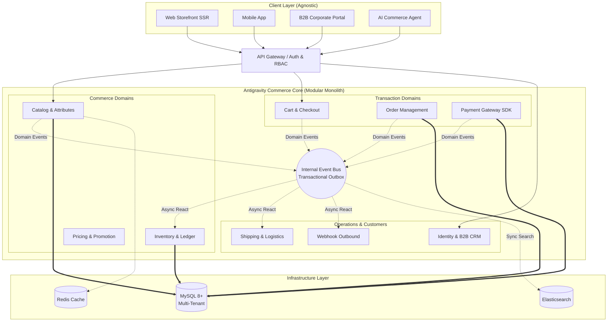
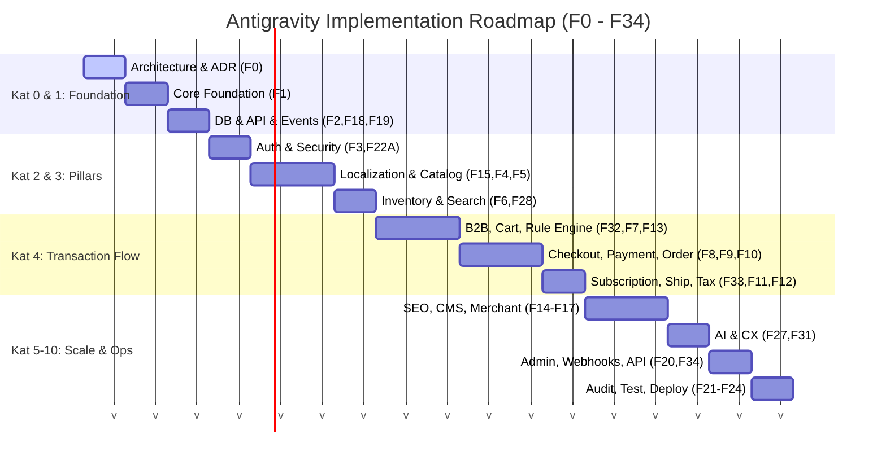

# 🚀 Antigravity E-Commerce Core Platform

> **System Architect:** Ulaş Kaşıkcı  
> **Phase:** 0 (Architecture & Foundation)  
> **Type:** Enterprise-Grade Commerce Core (B2B, B2C, SaaS)  
> **Stack:** PHP, MySQL 8+, Redis, Elasticsearch


---

## 📖 Executive Summary

**Antigravity E-Commerce** is a next-generation backend commerce core designed for hyper-scalability, strict engineering invariants, and complete platform agnosticism. 

Rejecting the traditional monolithic spaghetti architecture, Antigravity implements a **Strict Modular Monolith** driven by an internal **Event Bus** and **Transactional Outbox**. It provides a 100% **Headless & API-First** ecosystem where Omnichannel Storefronts, Mobile Apps, B2B Portals, and AI Commerce Agents interact with the exact same core truth.

---

## 🏛️ System Architecture & Context Map

The architecture enforces strict domain isolation. Bounded contexts (e.g., Catalog, Order, Inventory) own their respective database tables and communicate purely via API contracts or asynchronous Domain Events.



---

## 🏗️ Implementation Hierarchy (10 Tiers / 36 Phases)

The construction of the Antigravity platform follows a strict 10-tier, 36-phase execution pipeline. A layer cannot begin until the preceding layer is fully certified (tested, audited, documented).



---

## 🛡️ Core Engineering Invariants

The platform is strictly governed by the following engineering contracts. Any PR violating these invariants will fail the CI/CD pipeline:

1. **Idempotency by Design:** All critical side-effect operations (`POST /orders`, `POST /payments`) require an `Idempotency-Key` to prevent duplicate processing during network retries.
2. **Canonical Inventory Model:** `available = on_hand - reserved - committed`. State changes are backed by an immutable stock ledger.
3. **Webhook Deduplication:** Handled strictly via an `INSERT-first` mechanism based on unique `provider_event_id` hashes to prevent multiple asynchronous workers from processing the same event.
4. **Data Isolation:** Enforced globally at the Query Builder level. Every operational table contains a `tenant_id`. Cross-tenant data leakage is structurally impossible.
5. **AI Authorization Boundaries:** RAG models and AI Agents operate under strict Risk-Level IAM. While product retrieval (Low Risk) is open, mutations like cart generation and payment (High Risk) require Explicit User Confirmation.

---

## 📂 Project Structure & Governance

```text
/
├── ARCHITECTURE_MASTER_SPEC.md   # The absolute engineering constitution (Invariants, Domain Boundaries)
├── PROJE_DETAY.md                # Executive vision and high-level platform capabilities
├── YAPILACAKLAR.md               # Master checklist of the 36 execution steps (F0-F34)
└── docs/
    ├── planlama/                 # Granular phase definitions and task breakdowns (F0-F34)
    └── adr/                      # Architecture Decision Records (ADRs)
```

**Next Steps:** Review the [YAPILACAKLAR.md](yapilacaklar.md) to track active phase progression or read the [ARCHITECTURE_MASTER_SPEC.md](ARCHITECTURE_MASTER_SPEC.md) before contributing code.
