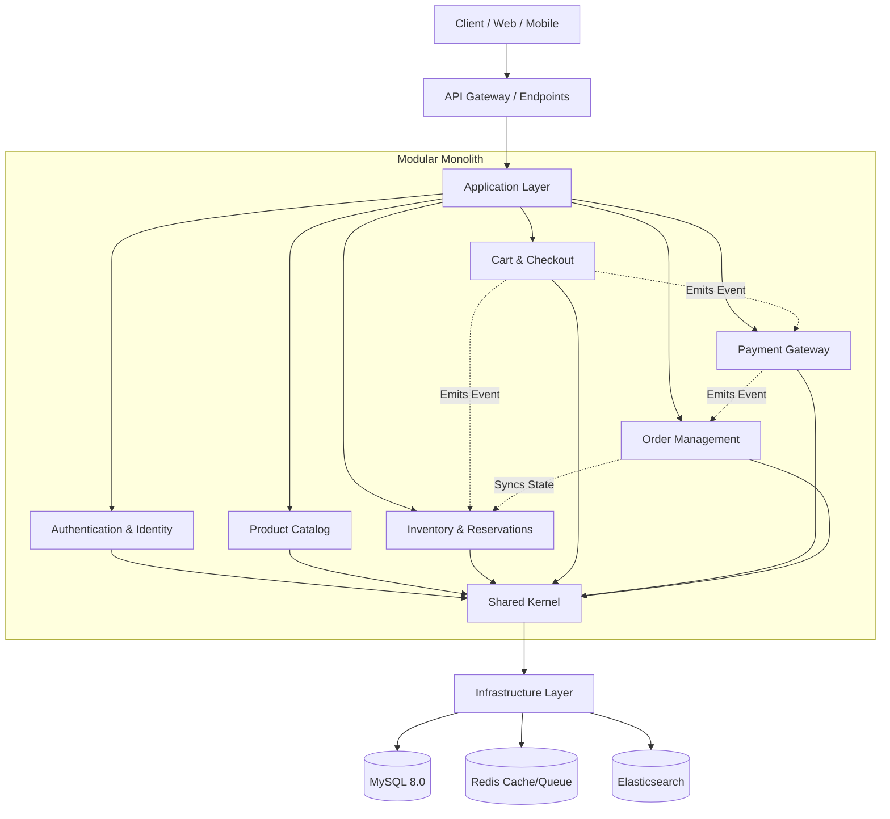

# 🚀 Enterprise E-Commerce Core Platform

**System Architect:** Ulaş Kaşıkcı  
**Version:** 1.3.0 (Foundation Implemented)  
**Architecture:** Modular Monolith (Domain-Driven Design)

An enterprise-grade, high-performance, and fully scalable e-commerce backend built with modern PHP. Designed to handle high-concurrency operations, complex inventory reservations, and distributed workflows.

---

## 🏛️ System Architecture

This project strictly adheres to a **Modular Monolithic** architecture driven by Domain-Driven Design (DDD). The architecture enforces strict boundaries using `Deptrac`, static analysis via `PHPStan` (Level 9), and continuous testing via `Pest`.

### Architectural Map



---

## 🛠️ Technology Stack

- **Core:** Laravel 11.x, PHP 8.3
- **Database:** MySQL 8.0+ (Strict standard)
- **Primary Keys:** ULID (Universally Unique Lexicographically Sortable Identifier)
- **Static Analysis:** PHPStan (Level 9), Larastan
- **Architecture Enforcement:** Deptrac
- **Testing:** Pest PHP
- **CI/CD:** GitHub Actions (Fail-Closed Architecture)

---

## 🗺️ Project Execution Roadmap (Phases)

The project is structured into logical, distinct implementation phases. Each phase acts as a strict gate.

| Phase | Title | Status | Description |
|---|---|---|---|
| **F0** | Architecture & Specifications | ✅ Completed | Master Architecture specification, invariant rules, and tech stack finalized. |
| **F1** | Core Foundation | ✅ Completed | Framework setup, CI/CD pipeline, Pest, PHPStan (L9), Deptrac, ULIDs, and base tenant context. |
| **F2** | Database & Tenancy Hardening | 🏗️ Pending | Table schemas, indexing strategies, robust multi-tenancy implementation. |
| **F3** | Authentication & Identity | ⏳ Planned | User, Admin, and Role-Based Access Control (RBAC). |
| **F4** | Catalog & Products | ⏳ Planned | Core product data, categories, variant engine. |
| **F5** | Inventory & Reservation | ⏳ Planned | Immutable ledger system, concurrency-safe stock reservation, available-to-promise logic. |
| **F6-F9** | Cart, Checkout, Payment | ⏳ Planned | Stateful checkout process, idempotency layers, external payment gateway integrations. |
| **F10+** | Post-Checkout Ecosystem | ⏳ Planned | Order fulfillment, logistics, notifications, and analytics. |

---

## 🔒 Architectural Tenets

1. **Strict MySQL Standard:** All relational structured data uses MySQL 8.0. No mixed PostgreSQL operations.
2. **Immutable Inventory Ledger:** Stock changes are append-only.
3. **Fail-Closed Integration:** If static analysis (`phpstan`), boundary checks (`deptrac`), or automated tests (`pest`) fail, the build fails.
4. **Idempotent APIs:** All mutation operations require `Idempotency-Key` headers to safely retry network errors.
5. **No Cross-Module Database Joins:** A domain cannot join another domain's tables directly. Data aggregation must happen at the application layer or via read-models.

---

## ⚙️ Development Environment

### Prerequisites
- PHP >= 8.3
- Composer >= 2.7
- MySQL >= 8.0
- Redis

### Setup

```bash
# 1. Clone the repository
git clone https://github.com/clariongemini/ticaret.git
cd ticaret

# 2. Install dependencies
composer install

# 3. Setup environment
cp .env.example .env
php artisan key:generate

# 4. Run tests and static analysis
./vendor/bin/pest
./vendor/bin/phpstan analyse
./vendor/bin/deptrac analyse
```

---

*Designed and Architected by Ulaş Kaşıkcı*
